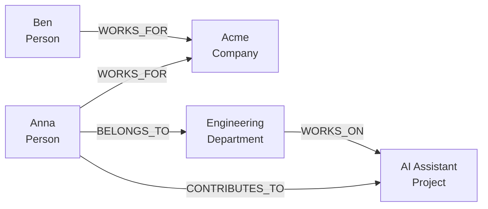

```mermaid
flowchart LR
    N0["Anna<br/>Person"]
    N1["Ben<br/>Person"]
    N2["Acme<br/>Company"]
    N3["Engineering<br/>Department"]
    N4["AI Assistant<br/>Project"]
    N0 --WORKS_FOR--> N2
    N1 --WORKS_FOR--> N2
    N0 --BELONGS_TO--> N3
    N3 --WORKS_ON--> N4
    N0 --CONTRIBUTES_TO--> N4
```